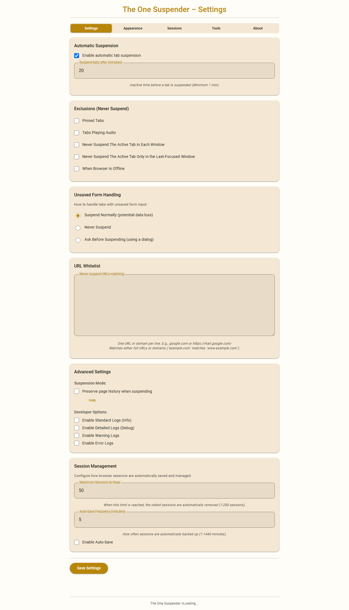
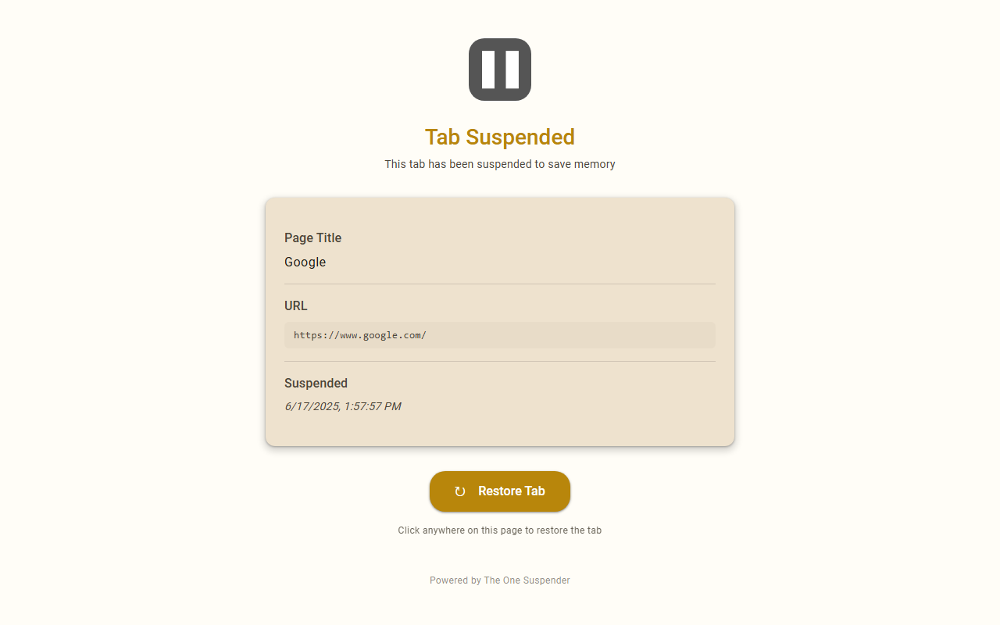

# The One Suspender

**Available now on the Chrome Web Store!** 🎉

**[📦 Install from Chrome Web Store](https://chromewebstore.google.com/detail/unasuspender-theonesuspen/kbnejigpbcogccaakoafohhkpjpdnipo)**

## Why The One Suspender?

I developed this extension because The Marvelous Suspender (TMS) could not support Manifest V3, and I couldn't find an alternative that met my specific needs. Rewriting TMS from scratch was a more viable path than attempting to port it. The One Suspender includes all the features you're familiar with from The Great Suspender and TMS, plus additional improvements.

Auto-suspend inactive tabs with full manual controls, robust scheduling, modern security for Chrome (Manifest V3), and a clean Material Design interface with multiple color themes.

## Easy Migration From The Marvelous Suspender

The One Suspender includes a **one-click migration tool** that automatically detects and converts all your existing Marvelous Suspender tabs to The One Suspender format. Simply visit the migration page from the Options menu and click "Migrate All Tabs" to seamlessly transition your suspended tabs.

## Screenshots

Here's a look at The One Suspender's Material Design interface:

**Material Design UI with Multiple Color Themes**

The One Suspender features a redesigned interface with **12 color themes** to match your personal style. Choose from light and dark variants of Gold, Platinum, Emerald, Sapphire, Ruby, Amethyst, Copper, Obsidian, Steel, and Midnight themes.

**Options Page - Settings, Appearance & Tools:**

**Extension Popup (Interactive Browser Context):**

**Suspended Page:**

## Features

### **Automatic Tab Suspension**
- **Smart Scheduling**: Frees memory by suspending inactive tabs after a user-defined timeout
- **Conditional Exceptions**: Never suspend pinned tabs, tabs playing audio, active tabs, tabs with unsaved form data, or when browser is offline
- **Dynamic Rescheduling**: Automatically reschedules suspension when tab status changes

### **Two Suspension Modes**
- **Preserve History (Default)**: Uses Chrome's tab discarding API to maintain back/forward navigation history
- **Close & Reopen (Experimental)**: Completely closes and reopens tabs to potentially free more memory but loses tab history

### **Manual Controls**
- **Individual Tab Control**: Suspend/unsuspend specific tabs via popup or keyboard shortcuts
- **Bulk Operations**: Suspend/unsuspend all tabs in current window or all windows
- **Multi-Tab Selection**: Select multiple tabs in popup for batch operations
- **Quick Actions**: Never suspend URL/domain toggles in popup

### **Export/Import Suspended Tabs**
**Easily backup, migrate, or share your suspended tabs across devices!**

- **Export Options**: 
  - Download all currently suspended tabs as JSON or TXT format
  - Preserves complete window/tab structure with titles, favicons, and original URLs
  - Includes tab positioning and pinned status
- **Import Capabilities**:
  - Recreate exact window/tab structure from exported files
  - Automatic extension ID handling for cross-device compatibility
  - Comprehensive error handling and validation
  - Immediately suspends imported tabs to maintain session state

### **⌨️ Comprehensive Keyboard Shortcuts**
Configure custom keyboard shortcuts for all major actions:
- **Suspend/unsuspend current tab** (Default: Ctrl+Shift+S)
- **Suspend/unsuspend all tabs in current window**
- **Suspend/unsuspend all tabs in all windows**
- **Open extension settings**
- **Individual tab shortcuts** for quick access

### **🎨 Advanced Theme System**
- **12 Color Themes**: Gold, Platinum, Emerald, Sapphire, Ruby, Amethyst, Copper, Obsidian, Steel, Midnight (each with light/dark variants)
- **Instant Theme Switching**: Changes apply immediately across all extension pages
- **Material Design 3**: Modern color system with proper contrast ratios and accessibility

### **Whitelist Management**
- **Flexible Patterns**: Support for exact URLs, domains, and wildcard patterns
- **Global Wildcard**: Use `*` to match all URLs (effectively disable auto-suspension)
- **Popup Integration**: Quick "Never Suspend URL/Domain" toggles add to whitelist instantly
- **Pattern Validation**: Real-time validation of whitelist entries

---

## 📦 Installation

### Option 1: Chrome Web Store (Recommended)

**[📦 Install from Chrome Web Store](https://chromewebstore.google.com/detail/unasuspender-theonesuspen/kbnejigpbcogccaakoafohhkpjpdnipo)**

1. Visit the Chrome Web Store link above
2. Click "Add to Chrome"
3. The extension icon will appear in your toolbar

### Option 2: Direct CRX Installation

1. Download the latest `.crx` file from [Releases](https://github.com/enderunal/TheOneSuspender/releases)
2. Go to `chrome://extensions` in Chrome
3. Enable "Developer mode" (top right)
4. Drag and drop the `.crx` file onto the extensions page
5. Click "Add extension" when prompted

### Option 3: Manual Installation (Development)

1. Download or clone this repository
2. Go to `chrome://extensions` in Chrome
3. Enable "Developer mode" (top right)
4. Click "Load unpacked" and select the project directory
5. The extension icon will appear in your toolbar

## 📄 License

This project is licensed under the MIT License - see the [LICENSE](LICENSE) file for details.
